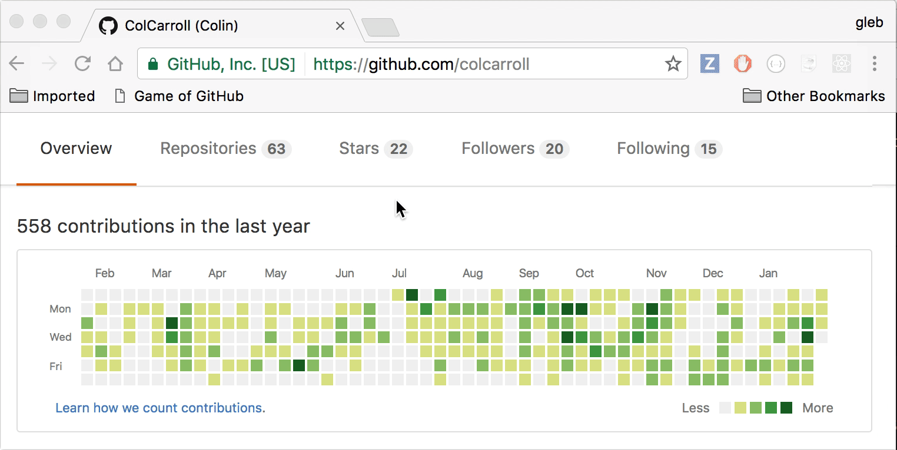
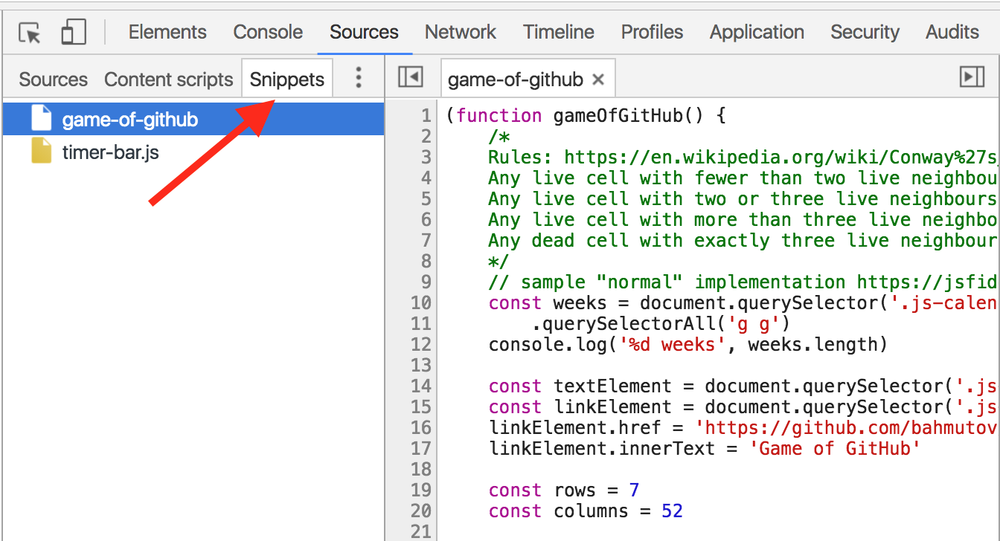

# game-of-github

> Play Game of Life in your GitHub contributions

Some people have legit gliders [https://github.com/colcarroll](https://github.com/colcarroll)

## How to use

### As a bookmarklet

You can drag the Game of GitHub bookmarklet from
[https://glebbahmutov.com/game-of-github/](https://glebbahmutov.com/game-of-github/)

Manually you can create bookmarklet from
[index.min.js](https://raw.githubusercontent.com/bahmutov/game-of-github/master/index.min.js) - do not forget to prepend code with `javascript:` when
saving the bookmarklet.

### Copy / paste

- Copy contents of [index.js](index.js)
- Open DevTools while on `https://github.com/username`
- Paste contents into the DevTools console

It should start the "Game of GitHub" 😎

**Hint** [https://github.com/lholznagel](https://github.com/lholznagel) has
the [most awesome one](https://youtu.be/52-BfHPTtnE)! Much better than my
little [oscillators](https://youtu.be/gowPfBWkBKc).

### As a code snippet

- Open DevTools / Sources tab
- Open "Snippets" left tab
- Right click and create new snippet
- Paste the [index.js](index.js) and Save (Right click and select "Save")

Now you can run this snippet over and over.

More about [code snippets](https://glebbahmutov.com/blog/chrome-dev-tools-code-snippets/)

## Links

* [Game of Life rules](https://en.wikipedia.org/wiki/Conway%27s_Game_of_Life)
* [Sample JS implementation](https://jsfiddle.net/concannon/sy9py6qa/)

### Small print

Author: Gleb Bahmutov &lt;gleb.bahmutov@gmail.com&gt; &copy; 2017

* [@bahmutov](https://twitter.com/bahmutov)
* [glebbahmutov.com](http://glebbahmutov.com)
* [blog](http://glebbahmutov.com/blog)

License: MIT - do anything with the code, but don't blame me if it does not work.

Support: if you find any problems with this module, email / tweet /
[open issue](https://github.com/bahmutov/game-of-github/issues) on Github

## MIT License

Copyright (c) 2017 Gleb Bahmutov &lt;gleb.bahmutov@gmail.com&gt;

Permission is hereby granted, free of charge, to any person
obtaining a copy of this software and associated documentation
files (the "Software"), to deal in the Software without
restriction, including without limitation the rights to use,
copy, modify, merge, publish, distribute, sublicense, and/or sell
copies of the Software, and to permit persons to whom the
Software is furnished to do so, subject to the following
conditions:

The above copyright notice and this permission notice shall be
included in all copies or substantial portions of the Software.

THE SOFTWARE IS PROVIDED "AS IS", WITHOUT WARRANTY OF ANY KIND,
EXPRESS OR IMPLIED, INCLUDING BUT NOT LIMITED TO THE WARRANTIES
OF MERCHANTABILITY, FITNESS FOR A PARTICULAR PURPOSE AND
NONINFRINGEMENT. IN NO EVENT SHALL THE AUTHORS OR COPYRIGHT
HOLDERS BE LIABLE FOR ANY CLAIM, DAMAGES OR OTHER LIABILITY,
WHETHER IN AN ACTION OF CONTRACT, TORT OR OTHERWISE, ARISING
FROM, OUT OF OR IN CONNECTION WITH THE SOFTWARE OR THE USE OR
OTHER DEALINGS IN THE SOFTWARE.
